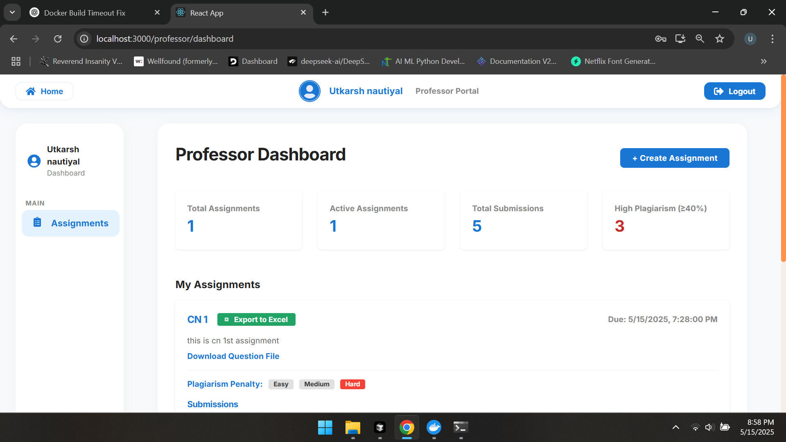
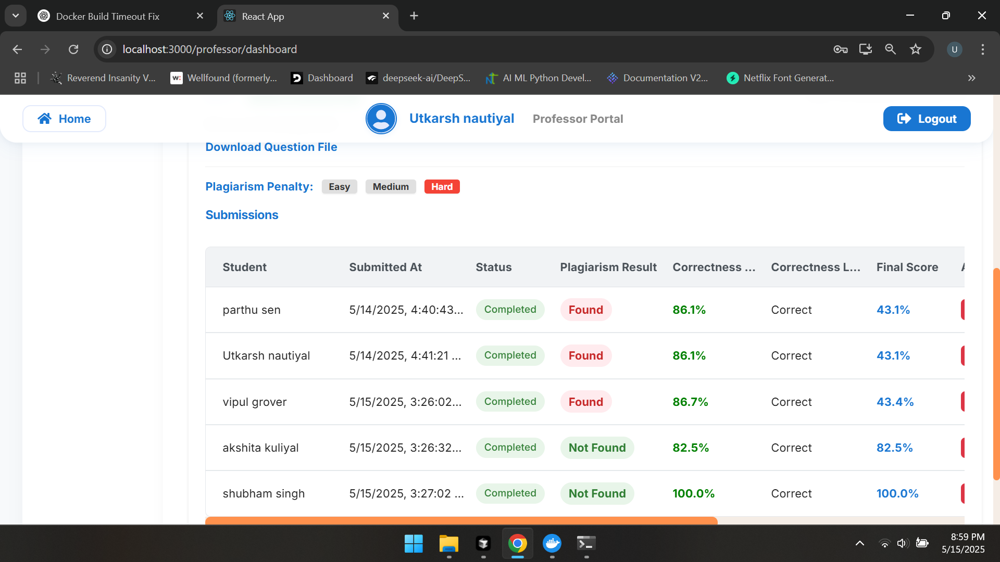
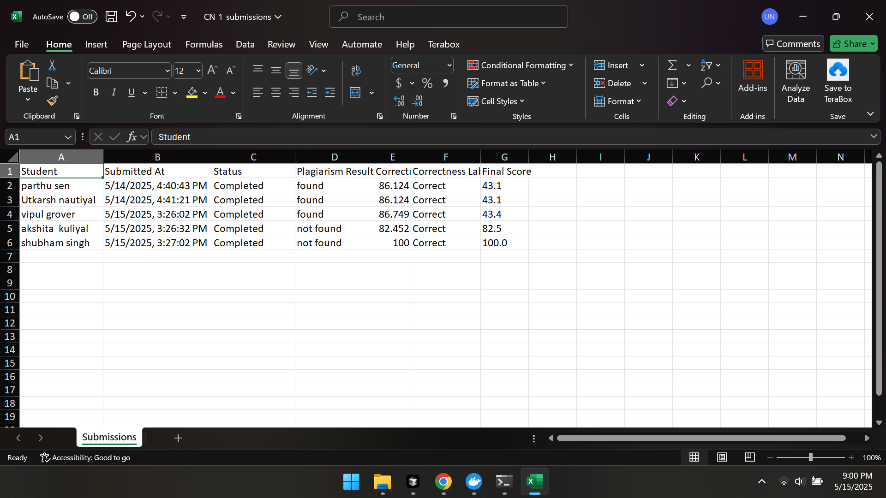

# AutoAssign


---

## 🚀 Executive Summary

**AutoAssign** is a next-generation, scalable web platform that empowers educators to uphold academic integrity with confidence. Leveraging state-of-the-art NLP, a modern microservices-inspired stack, and a beautiful user experience, this project is built for real-world impact and seamless deployment at scale.

---

## 💡 Why This Project Stands Out

- **Real-World Impact:** Designed for universities and schools to automate and streamline plagiarism detection, saving hours of manual review.
- **Modern, Scalable Stack:** Dockerized Flask (Python) backend, React frontend, and MongoDB Atlas for cloud-grade reliability.
- **Production-Ready:** Robust error handling, environment-based configuration, and secure authentication.
- **Teamwork & Extensibility:** Modular codebase, clear API boundaries, and easy integration of new features or algorithms.
- **Beautiful UI/UX:** Clean, responsive dashboard with intuitive controls and exportable reports.

---

## ✨ Features

- **Advanced Plagiarism Detection**
  - Combines MinHash+LSH and TF-IDF/Cosine Similarity for high-accuracy detection
  - Smart preprocessing: lowercasing, punctuation & stopword removal, shingling
  - Flags all matching submissions, not just the latest
- **User-Friendly Dashboard**
  - Professor dashboard with sortable, filterable tables
  - Delete submissions with a single click
  - Export results to Excel (with Excel-style button)
- **Plagiarism Severity Management**
  - Assignment-level severity bar (easy/medium/hard)
  - Severity directly impacts final score calculation
- **Elegant UI/UX**
  - Responsive, clean, and modern design
  - Fixed-width columns, ellipsis, and tooltips for clarity
- **Cloud-Ready & Scalable**
  - Dockerized backend, frontend, and MongoDB Atlas for easy, global deployment
  - Uses service names for seamless inter-container communication
  - Data persistence with Docker volumes
- **Extensible**
  - Easily add new detection algorithms or integrate with other systems

---

## 🏗️ Architecture

- **Backend:** Flask (Python), Gunicorn, MongoDB Atlas, Poppler, Tesseract
- **Frontend:** React, served with `serve`
- **Database:** MongoDB Atlas (cloud-hosted)
- **Containerization:** Docker & Docker Compose

```
[User] ⇄ [Frontend (React)] ⇄ [Backend (Flask API)] ⇄ [MongoDB Atlas]
```

---

## 🌍 Scalability & Production-Readiness

- **Cloud-Native:** Connects to MongoDB Atlas for high availability and global access.
- **Stateless API:** Backend can be scaled horizontally with zero downtime.
- **Persistent Storage:** Data is safe and accessible from anywhere.
- **Secure & Configurable:** All secrets and URIs managed via environment variables.
- **CI/CD Friendly:** Dockerized for seamless integration into any deployment pipeline.

---

## 🛠️ Setup & Installation

### Prerequisites
- [Docker](https://docs.docker.com/get-docker/)
- [Docker Compose](https://docs.docker.com/compose/install/)
- A [MongoDB Atlas](https://www.mongodb.com/atlas/database) cluster (or your own MongoDB URI)

### Quick Start
1. **Clone the repository:**
   ```sh
   git clone https://github.com/utcrxsh/autoassign.git
   cd autoassign
   ```
2. **Set your environment variables:**
   - Create a `.env` file or pass them directly when running Docker:
     - `MONGODB_URI` (your Atlas connection string)
     - `SECRET_KEY` (any random string)
3. **Build and run all services:**
   ```sh
   docker-compose up --build
   ```
4. **Access the app:**
   - Frontend: [http://localhost](http://localhost)
   - Backend API: [http://localhost:5000](http://localhost:5000)

### Stopping the App
- Press `Ctrl+C` in the terminal
- To remove containers and networks:
  ```sh
  docker-compose down
  ```

---

## 🖼️ Screenshots


### Dashboard


### Plagiarism Detection


### Export to Excel


---

## 🤝 Contributing

Pull requests are welcome! For major changes, please open an issue first to discuss what you would like to change.

---

## 📄 License

[MIT](LICENSE)

---

## 💬 Acknowledgements
- Built with Flask, React, MongoDB Atlas, Docker, and modern NLP libraries
- Inspired by the need for fair and scalable academic integrity solutions
